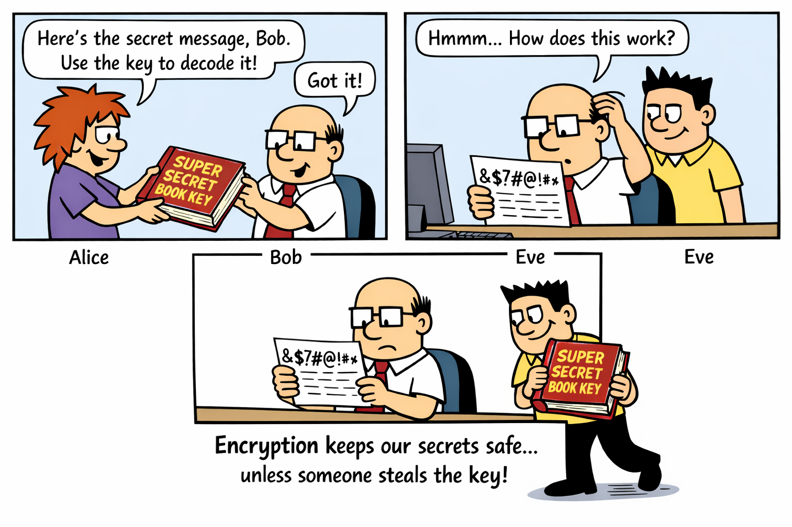

# Encryption 🔐


<!-- WARNING: THIS FILE WAS AUTOGENERATED! DO NOT EDIT! -->

<figure>

<figcaption aria-hidden="true">Alice and Bob want to share messages
privately but Eve the evesdropper wants to read them</figcaption>
</figure>

## TLDR; (too long didn’t read)

**Encryption = lock & unlock with a key! 🔐**

- Encryption can be **reversed** - you can decrypt messages back to the
  original
- You need a **key** to encrypt AND decrypt
- Without the key, encrypted messages look like gibberish
- This protects messages while they’re being sent (like emails or texts)
- Different from hashing: encryption is two-way, hashing is one-way only

## Background Information

Remember Alice and Bob from the book cipher? They want to send secret
messages to each other, but Eve (the eavesdropper) is trying to read
them!

**Encryption** is like putting your message in a locked box. Only
someone with the right key can unlock it and read the message.

### How does encryption work?

1.  **Encrypt**: Take your original message (called “plaintext”) and
    scramble it using a **key**
2.  **Send**: Send the scrambled message (called “ciphertext”) - even if
    Eve intercepts it, she can’t read it!
3.  **Decrypt**: The receiver uses the same **key** to unscramble the
    message back to plaintext

### Why is this important?

Every day, encryption protects your data: - 🔒 **HTTPS websites**
encrypt your browsing so hackers can’t see what you’re doing - 💬
**Messaging apps** encrypt your messages so only you and the recipient
can read them - 💳 **Online shopping** encrypts your payment details so
they can’t be stolen - 📧 **Email** can be encrypted to keep your
private conversations safe

### Encryption vs Hashing

<table>
<colgroup>
<col style="width: 25%" />
<col style="width: 41%" />
<col style="width: 33%" />
</colgroup>
<thead>
<tr>
<th>Feature</th>
<th>Encryption 🔐</th>
<th>Hashing 🔒</th>
</tr>
</thead>
<tbody>
<tr>
<td>Can it be reversed?</td>
<td>✅ Yes (with the key)</td>
<td>❌ No (one-way only)</td>
</tr>
<tr>
<td>What’s it used for?</td>
<td>Protecting data in transit</td>
<td>Protecting stored passwords</td>
</tr>
<tr>
<td>Do you need a key?</td>
<td>✅ Yes (to encrypt AND decrypt)</td>
<td>❌ No (just hash it)</td>
</tr>
<tr>
<td>Example</td>
<td>Encrypted email message</td>
<td>Hashed password in database</td>
</tr>
</tbody>
</table>

Both are important for security, but they solve different problems!

------------------------------------------------------------------------

## Practical Activity: Caesar Cipher Encryption 🔐

### Objective

Learn how encryption works by creating your own Caesar cipher in Python.
Discover how keys work and why encryption can be reversed (unlike
hashing).

### You will need

- A computer with Python installed
- The Python code below
- Paper and pen to record your findings

### What is a Caesar Cipher?

The Caesar cipher is one of the oldest encryption methods! It was used
by Julius Caesar over 2000 years ago. It works by “shifting” each letter
in the alphabet by a certain number of positions.

**Example with shift of 3:** - A → D (A is the 1st letter, shift 3 → D
is the 4th letter) - B → E - C → F - … - X → A (wraps around to the
beginning) - Y → B - Z → C

The **shift number** is the **key**!

------------------------------------------------------------------------

## Step 1: Set up your encryption tool

Run this Python code to create your Caesar cipher encryption and
decryption tool:

``` python
def caesar_encrypt(message, shift):
    """Encrypt a message using Caesar cipher with a given shift (key)"""
    encrypted = ""
    
    for char in message:
        if char.isalpha():  # Only shift letters, not spaces or punctuation
            # Determine if it's uppercase or lowercase
            if char.isupper():
                # Shift uppercase letters
                shifted = chr((ord(char) - ord('A') + shift) % 26 + ord('A'))
            else:
                # Shift lowercase letters
                shifted = chr((ord(char) - ord('a') + shift) % 26 + ord('a'))
            encrypted += shifted
        else:
            # Keep spaces, punctuation, and numbers as they are
            encrypted += char
    
    return encrypted


def caesar_decrypt(encrypted_message, shift):
    """Decrypt a message using Caesar cipher with a given shift (key)"""
    # Decrypting is just encrypting with the opposite shift!
    return caesar_encrypt(encrypted_message, -shift)


# Test it out!
original_message = "Hello Alice"
key = 3  # The shift/key

encrypted = caesar_encrypt(original_message, key)
decrypted = caesar_decrypt(encrypted, key)

print(f"Original message: {original_message}")
print(f"Key (shift):      {key}")
print(f"Encrypted:        {encrypted}")
print(f"Decrypted:        {decrypted}")
print(f"\n✅ Success! Encryption and decryption work!")
```

    Original message: Hello Alice
    Key (shift):      3
    Encrypted:        Khoor Dolfh
    Decrypted:        Hello Alice

    ✅ Success! Encryption and decryption work!

------------------------------------------------------------------------

## Step 2: Send secret messages!

Now you can encrypt messages and send them to a partner. Try encrypting
different messages:

``` python
# Try encrypting these messages
messages = [
    "Meet me at the park",
    "The password is secret",
    "Happy birthday Alice"
]

key = 5  # You and your partner must agree on the same key!

print("ENCRYPTING MESSAGES")
print("=" * 80)

for message in messages:
    encrypted = caesar_encrypt(message, key)
    print(f"Original:  {message}")
    print(f"Encrypted: {encrypted}")
    print()
```

    ENCRYPTING MESSAGES
    ================================================================================
    Original:  Meet me at the park
    Encrypted: Rjjy rj fy ymj ufwp

    Original:  The password is secret
    Encrypted: Ymj ufxxbtwi nx xjhwjy

    Original:  Happy birthday Alice
    Encrypted: Mfuud gnwymifd Fqnhj

------------------------------------------------------------------------

## Step 3: Decrypt messages from your partner

If your partner sends you an encrypted message, you can decrypt it using
the same key:

``` python
# Your partner sends you this encrypted message
encrypted_from_partner = "Mjqqt rj fy ymj ufwp"  # What does this say?
shared_key = 5  # You both agreed on this key

decrypted = caesar_decrypt(encrypted_from_partner, shared_key)

print("DECRYPTING A MESSAGE")
print("=" * 80)
print(f"Encrypted message: {encrypted_from_partner}")
print(f"Key:                {shared_key}")
print(f"Decrypted message: {decrypted}")
print("\n✅ You can read the secret message!")
```

    DECRYPTING A MESSAGE
    ================================================================================
    Encrypted message: Mjqqt rj fy ymj ufwp
    Key:                5
    Decrypted message: Hello me at the park

    ✅ You can read the secret message!

------------------------------------------------------------------------

## Step 4: Investigate encryption properties

Now try to answer these investigation questions by experimenting:

``` python
# Investigation 1: What happens with different keys?
print("INVESTIGATION 1: Different keys = different encryption")
print("=" * 80)

message = "Secret message"
keys = [1, 3, 5, 13, 26]

for key in keys:
    encrypted = caesar_encrypt(message, key)
    print(f"Key {key:2}: {message} → {encrypted}")

print("\nNotice: Different keys produce completely different encrypted messages!")
```

    INVESTIGATION 1: Different keys = different encryption
    ================================================================================
    Key  1: Secret message → Tfdsfu nfttbhf
    Key  3: Secret message → Vhfuhw phvvdjh
    Key  5: Secret message → Xjhwjy rjxxflj
    Key 13: Secret message → Frperg zrffntr
    Key 26: Secret message → Secret message

    Notice: Different keys produce completely different encrypted messages!

``` python
# Investigation 2: Can we reverse it?
print("\nINVESTIGATION 2: Encryption is reversible!")
print("=" * 80)

original = "Meet at three o clock"
key = 7

encrypted = caesar_encrypt(original, key)
decrypted = caesar_decrypt(encrypted, key)

print(f"Original:  {original}")
print(f"Encrypted: {encrypted}")
print(f"Decrypted: {decrypted}")
print(f"\n✅ Encryption CAN be reversed! This is different from hashing.")
```


    INVESTIGATION 2: Encryption is reversible!
    ================================================================================
    Original:  Meet at three o clock
    Encrypted: Tlla ha aoyll v jsvjr
    Decrypted: Meet at three o clock

    ✅ Encryption CAN be reversed! This is different from hashing.

``` python
# Investigation 3: What happens without the key?
print("\nINVESTIGATION 3: Can Eve read the message without the key?")
print("=" * 80)

original = "The meeting is cancelled"
correct_key = 4
wrong_key = 10  # Eve guesses the wrong key

encrypted = caesar_encrypt(original, correct_key)
wrong_decrypt = caesar_decrypt(encrypted, wrong_key)
correct_decrypt = caesar_decrypt(encrypted, correct_key)

print(f"Original message:     {original}")
print(f"Encrypted:            {encrypted}")
print(f"\nEve's wrong key ({wrong_key}): {wrong_decrypt} ❌ Gibberish!")
print(f"Bob's correct key ({correct_key}): {correct_decrypt} ✅ Correct!")
print("\nNotice: Without the correct key, the message is unreadable!")
```


    INVESTIGATION 3: Can Eve read the message without the key?
    ================================================================================
    Original message:     The meeting is cancelled
    Encrypted:            Xli qiixmrk mw gergippih

    Eve's wrong key (10): Nby gyyncha cm wuhwyffyx ❌ Gibberish!
    Bob's correct key (4): The meeting is cancelled ✅ Correct!

    Notice: Without the correct key, the message is unreadable!

``` python
# Investigation 4: Compare to hashing
print("\nINVESTIGATION 4: Encryption vs Hashing")
print("=" * 80)

import hashlib

message = "secret"
encryption_key = 5

# Encrypt it
encrypted = caesar_encrypt(message, encryption_key)
decrypted = caesar_decrypt(encrypted, encryption_key)

# Hash it
hashed = hashlib.sha256(message.encode()).hexdigest()

print(f"Original message: {message}")
print(f"\nENCRYPTION (reversible):")
print(f"  Encrypted: {encrypted}")
print(f"  Decrypted: {decrypted} ✅ Can get original back!")
print(f"\nHASHING (one-way only):")
print(f"  Hashed:    {hashed}")
print(f"  Reversed:  ❌ IMPOSSIBLE - can't get original back!")
print(f"\nKey difference: Encryption = two-way, Hashing = one-way")
```


    INVESTIGATION 4: Encryption vs Hashing
    ================================================================================
    Original message: secret

    ENCRYPTION (reversible):
      Encrypted: xjhwjy
      Decrypted: secret ✅ Can get original back!

    HASHING (one-way only):
      Hashed:    2bb80d537b1da3e38bd30361aa855686bde0eacd7162fef6a25fe97bf527a25b
      Reversed:  ❌ IMPOSSIBLE - can't get original back!

    Key difference: Encryption = two-way, Hashing = one-way

------------------------------------------------------------------------

## Step 5: Create your own secret messages!

Now it’s your turn! Create encrypted messages and swap them with a
partner.

``` python
# Create your own encrypted messages
print("CREATE YOUR OWN SECRET MESSAGES")
print("=" * 80)

# Choose a key (share it with your partner secretly!)
my_key = 8  # Change this to your chosen key

# Write your messages here
my_messages = [
    "Your message here",
    "Another secret message",
    "One more message"
]

print(f"Using key: {my_key}\n")
print("ENCRYPTED MESSAGES (send these to your partner):")
print("-" * 80)

for msg in my_messages:
    encrypted = caesar_encrypt(msg, my_key)
    print(f"{encrypted}")

print("\n" + "-" * 80)
print("Share the key and encrypted messages with your partner!")
print("They should be able to decrypt them using the same key.")
```

    CREATE YOUR OWN SECRET MESSAGES
    ================================================================================
    Using key: 8

    ENCRYPTED MESSAGES (send these to your partner):
    --------------------------------------------------------------------------------
    Gwcz umaaiom pmzm
    Ivwbpmz amkzmb umaaiom
    Wvm uwzm umaaiom

    --------------------------------------------------------------------------------
    Share the key and encrypted messages with your partner!
    They should be able to decrypt them using the same key.

------------------------------------------------------------------------

## Discussion Questions

After completing the investigations, discuss these questions:

1.  **Two-way process**: Why can encryption be reversed, but hashing
    cannot?

2.  **The key**: Why is the key so important? What happens if someone
    intercepts your encrypted message but doesn’t have the key?

3.  **Key security**: If Eve steals your encrypted message, can she
    figure out the key by trying different numbers? (This is called a
    “brute force attack”)

4.  **Real world**: When would you use encryption instead of hashing?
    When would you use hashing instead of encryption?

5.  **Caesar cipher weakness**: The Caesar cipher is easy to break. Can
    you think of why? How do modern encryption methods protect against
    this?

6.  **Alice and Bob**: How does encryption help Alice and Bob
    communicate privately, even if Eve is listening?

------------------------------------------------------------------------

## Key Takeaways

✅ **Encryption is two-way** - You can encrypt AND decrypt messages

✅ **Keys are essential** - You need the same key to encrypt and decrypt

✅ **Protects data in transit** - Encryption keeps messages safe while
being sent

✅ **Different from hashing** - Encryption is reversible, hashing is
one-way only

✅ **Both are important** - Encryption and hashing solve different
security problems

✅ **Without the key = gibberish** - Encrypted messages are useless
without the correct key

------------------------------------------------------------------------

## Optional Stretch Activities 🌟

### Challenge 1: Brute force attack

Try to break an encrypted message by testing all possible keys (0-25).
How long does it take? Why is this a weakness of the Caesar cipher?

### Challenge 2: Frequency analysis

Research “frequency analysis” - a method used to break Caesar ciphers.
The letter ‘E’ is the most common in English. Can you use this to crack
a message?

### Challenge 3: Create a better cipher

Design your own encryption method. Can you make it harder to break than
the Caesar cipher?

### Challenge 4: Encryption vs Hashing comparison

Create a table comparing encryption and hashing. Include: - When each is
used - Whether they can be reversed - Whether they need a key -
Real-world examples of each

### Challenge 5: Research modern encryption

Look up “AES encryption” or “RSA encryption”. How are these different
from the Caesar cipher? Why are they more secure?

### Challenge 6: Key exchange problem

Alice and Bob need to share a key to encrypt messages. But how do they
share the key securely if Eve is listening? Research “Diffie-Hellman key
exchange” to find out!
