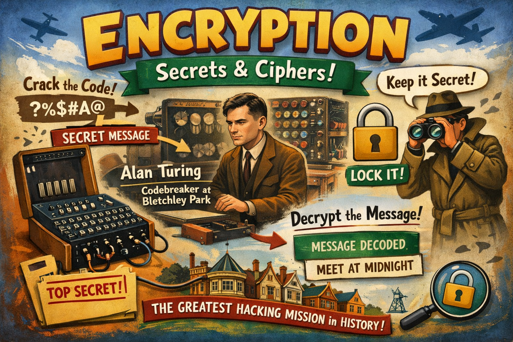

# Encryption vs Hashing

<!-- WARNING: THIS FILE WAS AUTOGENERATED! DO NOT EDIT! -->

<figure>

<figcaption aria-hidden="true">The art of cracking codes</figcaption>
</figure>

### TLDR; (too long didn’t read)

- **Encryption = lock & unlock 🔐 | Hashing = lock only 🔒**
- Encryption can be reversed. Hashing cannot.
- Both are usefule in different circumstances to protect your data
  e.g. your money!

### Background Information

Alan Turning, pressured into hacking the encrypted messages of the
German Enigma machine during World War 2, developed what we consider to
be the foundation of modern day computers. We call this a Turning
Machine. I guess you could call Turning a famous **hacker!** but he was
also a Cambridge professor of mathematics.

### Why is it useful today?

- To keep your online data safe (e.g. YOUR MONEY!) your bank will use
  Encryption and Hashing to protect your money.
- To secure your online activity e.g. The paddlock(🔒) in your browser
  signifies your connection is encrypted.

### Practical - Simple Book based Encryption

[Book Cipher Encryption](02_book_cipher_encryption.ipynb)

### Practical - Hashing

[Password Hashing](03_password_hashing.ipynb)

### Practical - Encryption

[Encryption](04_encryption.ipynb)
