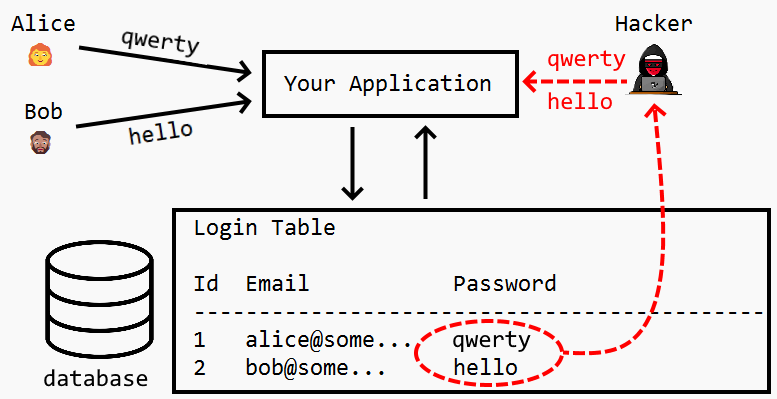

# Password Hashing 🔒


<!-- WARNING: THIS FILE WAS AUTOGENERATED! DO NOT EDIT! -->

<figure>

<figcaption aria-hidden="true">Alice and Bob get passwords stolen by a
Hacker</figcaption>
</figure>

## TLDR; (too long didn’t read)

**Hashing = scrambling passwords so NO ONE can read them! 🔒**

- Hashing is **one-way only** - you can’t reverse it
- Same password = same hash every time
- Even the website owner can’t see your real password!
- This protects you if hackers steal the database

## Background Information

When you create an account on a website, you choose a password. But did
you know that good websites **never** store your actual password?

Instead, they use a special mathematical process called **hashing** to
scramble it into a unique code. This code: - Always looks like random
letters and numbers - Can’t be reversed back to your password - Changes
completely if even one character in your password changes

### Why is this important?

Imagine a hacker breaks into a website’s database: - **Bad website**
(stores passwords): Hacker sees “password123” and can log into your
account! - **Good website** (stores hashes): Hacker sees
“ef92b778bafe771e89245b89ecbc08a44a4e166c06659911881f383d4473e94f” -
useless to them!

### How does login still work?

When you log in, the website: 1. Takes your password 2. Hashes it the
same way 3. Compares the hash to the one they stored 4. If they match -
you’re in! ✅

------------------------------------------------------------------------

## Practical Activity: Password Hashing Detective 🔍

### Objective

Explore how password hashing works using Python and discover why it’s a
one-way process.

### You will need

- A computer with Python installed
- The Python code below
- Paper and pen to record your findings

------------------------------------------------------------------------

## Step 1: Set up your password hasher

Run this Python code to create your password hashing tool:

``` python
import hashlib

def hash_password(password):
    """Hash a password using SHA-256"""
    # Convert password to bytes and hash it
    hashed = hashlib.sha256(password.encode()).hexdigest()
    return hashed

# Test it out!
test_password = "dragon"
hashed_result = hash_password(test_password)

print(f"Password: {test_password}")
print(f"Hash:     {hashed_result}")
print(f"\nHash length: {len(hashed_result)} characters")
```

    Password: dragon
    Hash:     a9c43be948c5cabd56ef2bacffb77cdaa5eec49dd5eb0cc4129cf3eda5f0e74c

    Hash length: 64 characters

------------------------------------------------------------------------

## Step 2: Experiment with different passwords

Try hashing different passwords and observe the results:

``` python
# Try these passwords
passwords = ["password", "password123", "Password123", "letmein", "qwerty"]

print("PASSWORD HASHING RESULTS")
print("=" * 80)

for pwd in passwords:
    hashed = hash_password(pwd)
    print(f"{pwd:15} → {hashed}")
```

    PASSWORD HASHING RESULTS
    ================================================================================
    password        → 5e884898da28047151d0e56f8dc6292773603d0d6aabbdd62a11ef721d1542d8
    password123     → ef92b778bafe771e89245b89ecbc08a44a4e166c06659911881f383d4473e94f
    Password123     → 008c70392e3abfbd0fa47bbc2ed96aa99bd49e159727fcba0f2e6abeb3a9d601
    letmein         → 1c8bfe8f801d79745c4631d09fff36c82aa37fc4cce4fc946683d7b336b63032
    qwerty          → 65e84be33532fb784c48129675f9eff3a682b27168c0ea744b2cf58ee02337c5

------------------------------------------------------------------------

## Step 3: Investigate the one-way property

Now try to answer these investigation questions by experimenting:

``` python
# Investigation 1: What happens with very similar passwords?
print("INVESTIGATION 1: Tiny changes = huge differences")
print("=" * 80)

similar_passwords = ["cat", "Cat", "cats", "cat1"]

for pwd in similar_passwords:
    hashed = hash_password(pwd)
    print(f"{pwd:10} → {hashed}")

print("\nNotice: Even changing ONE character completely changes the hash!")
```

    INVESTIGATION 1: Tiny changes = huge differences
    ================================================================================
    cat        → 77af778b51abd4a3c51c5ddd97204a9c3ae614ebccb75a606c3b6865aed6744e
    Cat        → 48735c4fae42d1501164976afec76730b9e5fe467f680bdd8daff4bb77674045
    cats       → d936608baaacc6b762c14b0c356026fba3b84e77d5b22e86f2fc29d3da09c675
    cat1       → 081706ccee3f19f01752ba7b60dec0f901a746fe4e3f8c00b70ee6671669c802

    Notice: Even changing ONE character completely changes the hash!

``` python
# Investigation 2: Is it consistent?
print("\nINVESTIGATION 2: Same password = same hash?")
print("=" * 80)

password = "elephant"
print(f"Hashing '{password}' five times:\n")

for i in range(1, 6):
    hashed = hash_password(password)
    print(f"  {i}. {hashed}")

print("\nNotice: The same password ALWAYS produces the same hash!")
```


    INVESTIGATION 2: Same password = same hash?
    ================================================================================
    Hashing 'elephant' five times:

      1. cd08c4c4316df20d9c30450fe776dcde4810029e641cde526c5bbffec1f770a3
      2. cd08c4c4316df20d9c30450fe776dcde4810029e641cde526c5bbffec1f770a3
      3. cd08c4c4316df20d9c30450fe776dcde4810029e641cde526c5bbffec1f770a3
      4. cd08c4c4316df20d9c30450fe776dcde4810029e641cde526c5bbffec1f770a3
      5. cd08c4c4316df20d9c30450fe776dcde4810029e641cde526c5bbffec1f770a3

    Notice: The same password ALWAYS produces the same hash!

``` python
# Investigation 3: Can we reverse it?
print("\nINVESTIGATION 3: Can we go backwards?")
print("=" * 80)

original = "secret"
hashed = hash_password(original)

print(f"Original password: {original}")
print(f"Hashed version:    {hashed}")
print(f"\n❌ There is NO way to reverse this hash back to '{original}'")
print("   Even the website owner cannot see your original password!")
```


    INVESTIGATION 3: Can we go backwards?
    ================================================================================
    Original password: secret
    Hashed version:    2bb80d537b1da3e38bd30361aa855686bde0eacd7162fef6a25fe97bf527a25b

    ❌ There is NO way to reverse this hash back to 'secret'
       Even the website owner cannot see your original password!

------------------------------------------------------------------------

## Step 4: Test your own passwords!

**Important Safety Note:** Don’t use your real passwords for practice!
Make up fake ones instead.

``` python
# Try your own passwords (use FAKE passwords only!)
print("HASH YOUR OWN PASSWORDS")
print("=" * 80)

# Replace these with your own test passwords
my_passwords = [
    "your_test_password_1",
    "your_test_password_2",
    "your_test_password_3"
]

for pwd in my_passwords:
    hashed = hash_password(pwd)
    print(f"{pwd:25} → {hashed}")
```

------------------------------------------------------------------------

## Discussion Questions

After completing the investigations, discuss these questions:

1.  **One-way process**: Why is it impossible to reverse a hash back to
    the original password?

2.  **Security**: If hackers steal a database of hashed passwords, why
    can’t they use them to log in?

3.  **Consistency**: Why is it important that the same password always
    produces the same hash?

4.  **Small changes**: What did you notice when you changed just one
    character in a password? Why is this important?

5.  **Real world**: Can you think of other situations where one-way
    hashing might be useful?

------------------------------------------------------------------------

## Key Takeaways

✅ **Hashing is one-way** - You can’t reverse it

✅ **Consistency matters** - Same input = same output (every time)

✅ **Tiny changes = huge differences** - Changing one character
completely changes the hash

✅ **Protects your privacy** - Even website owners can’t see your real
password

✅ **Security through mathematics** - Hashing uses complex math that’s
easy one way, impossible the other

------------------------------------------------------------------------

## Optional Stretch Activities 🌟

### Challenge 1: Password strength explorer

Hash passwords of different lengths. Does a longer password create a
longer hash?

### Challenge 2: Hash comparison

If someone gives you a hash, can you figure out what their password was
by trying common passwords? (This is called a “brute force attack”)

### Challenge 3: Encryption vs Hashing

Compare hashing to the encryption lesson you learned earlier: - Which
one can be reversed? - When would you use each one? - Why are both
important for security?

### Challenge 4: Research task

Look up “salt” in password hashing. Why do security experts add salt to
passwords before hashing them?
